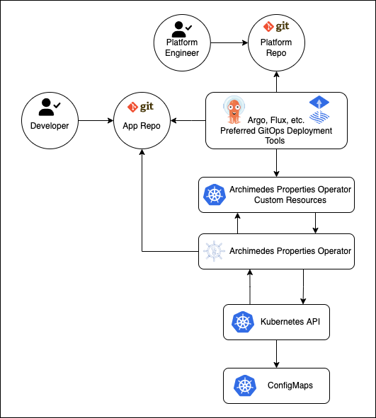

# Archimedes 
## Archimedes is a Kubernetes Operator written to allow for separate repos to control merged configurations for different environments using a GitOps approach.

## Artichitecture


Archimedes is designed to solve configuration issues that become difficult when trying to deploy the same applications to multiple environments where property values differ.  Developers of the applications should not need to worry dymanic platform properties.  They just need to know for their app this is a common set of properties that are needed for the applicaiton to run.  Envioroment level properties often change and you don't want developers having to make adjustments to individual application properties every time a platform configuration change is needed.   The solution is to provide a set of properties derived from the Platform repo and at the time of deployment fetch a template from the application repo and merge the 2 toghther to create a configmap that can be configured to be consumed by an application running in the same namespace.  To accomplish this a yaml string is supplied in the sourceConfig property in the ArchimedesProperty Kubernetes resource type specification along with the information pertaining to the repository where the application code resides containing a template file to be merged.  This template is merged via the go template engine which gives developers the ability to put logic into their tempates if such flexibility is needed.
## Installation
A helm chart for deployment is supplied in the chart/archimedes-property-operator.  This chart also includes the archimedes custom resource definition.

```sh
cd chart/archimedes-property-operator

kubectl apply -f crd/archimedes.backwoods-devops.io_archimedesproperties.yaml
```
Next steps would be to setup needed configuration and supply the credentials for your repo including a CA certificate if needed. Once that is ready you can install the operator.
```sh
helm install archimedes-property-operator .
```
## Usuage

To deploy a property 2 things are needed.  First item is a template file that will be stored in with the application repo.  This template will be parsed using the [golang text/template package](https://pkg.go.dev/text/template "text/template package")  A key value pair pattern is used to define the individual properties and values from a supplied sourceConfig in the ArchimedesProperty definition can be referenced as well as any of the features available in the text/template package.  This allows developers to place logic if needed to enhance flexibility.  
### Application Property Template

```
databaseName={{ .env.dbanme }}
databasePort={{ .env.dbport }}
{{- if ne .env.name "Production"}}
templateCache=true
{{- else}}
templateCache=false
{{- end}}
```

Next thing needed is the ArchimedesProperty definition.  

### Spec:

| Name | Description | Type |
| ----- | ----------- | ------- |
| name | name of the configmap to be created | string |
| repoURL | url to the repo containing the property template to be merged | string |
| revision | the commit hash, branch or tag | string |
| propertiesPath | the path to the template file | string |
| sourceConfig | a yaml configuration file supplied by the platform/env | string |
| propertyType | configmap data style.  Options are kvp or key.  kvp will create a separate entry for each line in the properties template.  key will place the results of the merged template as a string value under the name defined in keyName. | string |
| keyName | name of the key template results are saved to.  Only applies when propertyType is set to key | string |


### ArchimedesProperty

```yaml
apiVersion: archimedes.backwoods-devops.io/v1
kind: ArchimedesProperty
metadata:
  name: archimedesproperty-trees-app
  namespace: default
spec:
  name: trees-app-properties
  repoUrl: "https://github.com/backwoods-devops/archimedes.git"
  revision: main
  propertiesPath: config/samples/properties.tpl
  sourceConfig: |
    env:
      name: staging
      dbname: forest-data
      dbport: 5432
  propertyType: key
  keyName: config.properties
```

### Deploy your property

```sh
cat <<EOF | kubectl apply -f -
apiVersion: archimedes.backwoods-devops.io/v1
kind: ArchimedesProperty
metadata:
  name: archimedesproperty-trees-app
  namespace: default
spec:
  name: trees-app-properties
  repoUrl: "https://github.com/backwoods-devops/archimedes.git"
  revision: main
  propertiesPath: config/samples/properties.tpl
  sourceConfig: |
    env:
      name: staging
      dbname: forest-data
      dbport: 5432
  propertyType: key
  keyName: config.properties
EOF
```
## Extra properties added
There will be several properties automatically added.

commit, repoUrl, revision and path will be populated so they may be referenced as needed by your tooling to determine proper versioning

## Handy tips

Leverage a gitops tool such as [Argo CD](https://argoproj.github.io/cd/ "Argo CD") or [Flux](https://fluxcd.io/ "Flux").  Using these tools pass the desired sourceConfig or use helm chart to take multiple values and build out the sourceConfig yaml as desired for each env and deploy the AchimediesProperty file using that.  
	